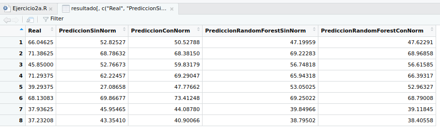

<!-- title: BigData - Informe parte 2 -->
# BigData - Proyecto parte 2

Proyecto asignatura BigData.  
Máster Universitario en Ingeniería Informática - Universidad Pablo de Olavide  

## Índice del trabajo final - parte2

- [1. Descripción de la entrega](#1-descripción-de-la-entrega).
- [2. Comparación de los resultados obtenidos por varias técnicas en el ejercicio 2a](#2-comparación-de-los-resultados-obtenidos-por-varias-técnicas-en-el-ejercicio-2a).
- [3. Análisis del conjunto de datos y de las líneas de distribución obtenidos en el ejercicio 2c](#3-análisis-del-conjunto-de-datos-y-de-las-líneas-de-distribución-obtenidos-en-el-ejercicio-2c).
- [4. Modelo de árbol obtenido por Random Forest](#4-modelo-de-árbol-obtenido-por-random-forest).

**Observaciones:** La visualización de los resultados (ejercicio 3). No la he realizado.

[Repositorio en Github - tag:2parte](https://github.com/giffunis/BigDataProject/tree/2parte/EntregaParte2)

### 1. Descripción de la entrega

- La carpeta `Parte2` es el directorio del proyecto en Scala usado para realizar los ejercicios. Dentro de `Parte2/src` se encuentran las clases que implementados para los apartados correspondientes.
- La carpeta `R-studio` contiene el ejercicio 2a con los ficheros fuentes de R y la comparativa de predicciones generada.
- El modelo de árbol obtenido por Random Forest se encuentra en la ruta `Parte2/salida_parte2/ejercicio2b/modelo_arbol.txt`. También en el [punto 4](#4-modelo-de-árbol-obtenido-por-random-forest) de este informe.

### 2. Comparación de los resultados obtenidos por varias técnicas en el ejercicio 2a

Se han implementado 2 técnicas de aprendizaje supervisado con 2 variaciones cada una:

- NeuralNetwork:
    - Sin normalización.
    - Con normalización.
- RandomForest:
    - Sin normalización.
    - Con normalización

Obteniéndose los siguientes resultados:

 
    
### 3. Análisis del conjunto de datos y de las líneas de distribución obtenidos en el ejercicio 2c

La clasificación obtenida se encuentra en el fichero `Parte2/salida_parte2/ejercicio2c/part-00000`. En ella, podemos observar la siguiente distribución:

| Cluster | Registros | Porcentaje |
| ------- | --------- | ---------- |
|   0     |   1401    |     25%    |
|   1     |   1574    |     28%    |
|   2     |   169     |     3%     |
|   3     |   1848    |     32%    |
|   4     |   712     |     12%    |

### 4. Modelo de árbol obtenido por Random Forest

    DecisionTreeModel regressor of depth 7 with 23 nodes
      If (feature 85 <= 75.5099985)
       If (feature 55 <= 34.1099985)
        Predict: 66.04624713194445
       Else (feature 55 > 34.1099985)
        If (feature 133 <= 55.88999750000001)
         If (feature 124 <= 54.179998499999996)
          If (feature 121 <= 48.239998)
           Predict: 38.71999823611111
          Else (feature 121 > 48.239998)
           If (feature 120 <= 52.109997)
            Predict: 37.391248465277776
           Else (feature 120 > 52.109997)
            If (feature 58 <= 37.1699985)
             Predict: 37.713331611111094
            Else (feature 58 > 37.1699985)
             Predict: 37.8899984236111
         Else (feature 124 > 54.179998499999996)
          If (feature 142 <= 35.6399995)
           Predict: 40.57374836805552
          Else (feature 142 > 35.6399995)
           Predict: 40.198748097222214
        Else (feature 133 > 55.88999750000001)
         Predict: 45.84999813888891
      Else (feature 85 > 75.5099985)
       If (feature 2 <= 53.369997)
        If (feature 95 <= 82.9799955)
         Predict: 72.14124699999996
        Else (feature 95 > 82.9799955)
         If (feature 106 <= 95.489994)
          Predict: 67.83749686111113
         Else (feature 106 > 95.489994)
          Predict: 68.13083040277778
       Else (feature 2 > 53.369997)
        Predict: 55.49124752777777

